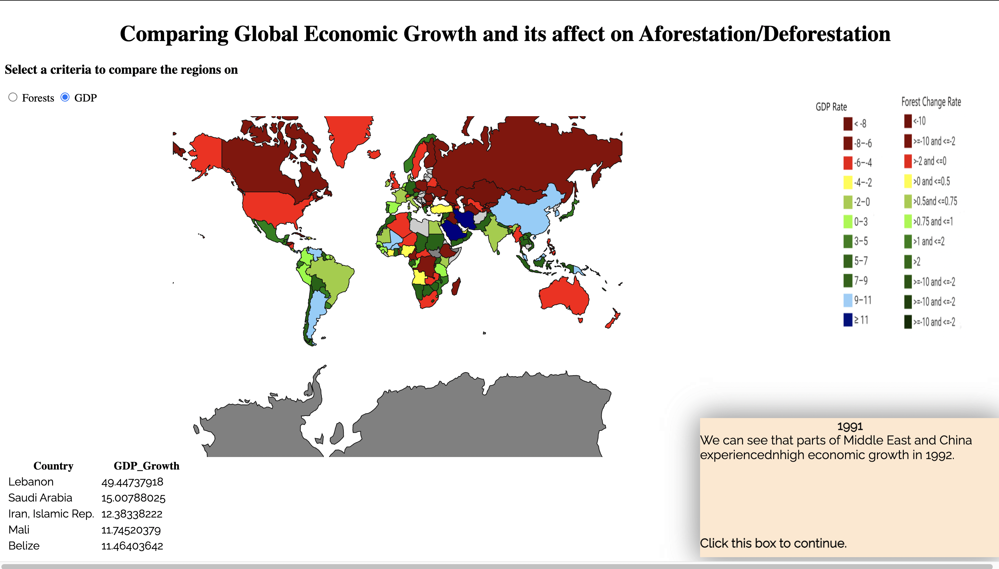

# Interactive component

For the purpose of interactive component of our project we use a guided tour visualization of map. There are two sections each having historical context to engage the user. The user can switch pages at its own pace.

The link to the visualization is https://sanketg97.github.io/EDAV_D3/